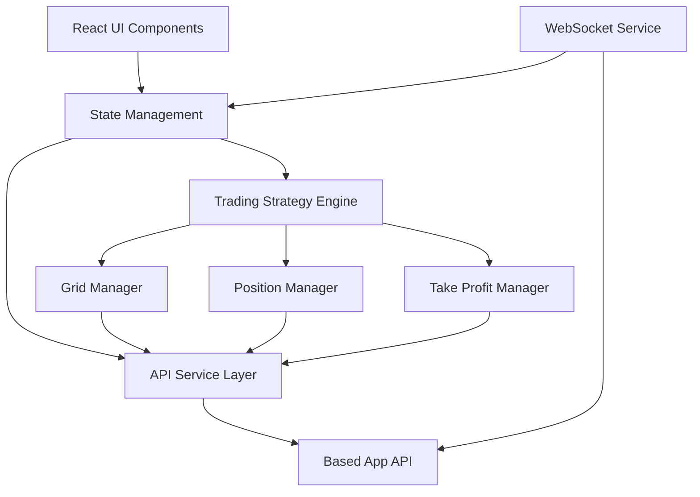

# Design Document

## Overview

베이스드앱 마팅게일 트레이딩 봇은 React 기반의 미니앱으로 구현되며, 베이스드앱 API를 통해 자동화된 그리드 트레이딩 전략을 실행합니다. 시스템은 사용자 설정 기반으로 그리드 주문을 배치하고, 포지션 관리 및 자동 청산 기능을 제공합니다.

## Architecture

### High-Level Architecture



### Component Architecture

시스템은 다음과 같은 주요 컴포넌트로 구성됩니다:

1. **UI Layer**: React 컴포넌트 기반 사용자 인터페이스
2. **State Management**: 애플리케이션 상태 관리 (Context API 또는 Redux)
3. **Trading Engine**: 핵심 트레이딩 로직 처리
4. **API Service**: 베이스드앱 API 통신 관리
5. **WebSocket Service**: 실시간 데이터 수신

## Components and Interfaces

### 1. UI Components

#### TradingConfigForm
- **Purpose**: 사용자 트레이딩 설정 입력
- **Props**: 
  - `onConfigSubmit: (config: TradingConfig) => void`
  - `availableCoins: Coin[]`
  - `maxLeverage: number`
- **State**: 폼 입력 값들 (coin, leverage, priceRange, gridCount, strategy, takeProfitPercent)

#### TradingDashboard
- **Purpose**: 실시간 트레이딩 상태 모니터링
- **Props**:
  - `positions: Position[]`
  - `gridOrders: GridOrder[]`
  - `currentPrice: number`
  - `profitLoss: number`
- **Features**: 포지션 목록, 그리드 상태, 수익률 표시

#### ControlPanel
- **Purpose**: 봇 시작/중지 제어
- **Props**:
  - `isRunning: boolean`
  - `onStart: () => void`
  - `onStop: () => void`

### 2. Core Services

#### BasedAppApiService
```typescript
interface BasedAppApiService {
  authenticate(credentials: ApiCredentials): Promise<AuthResult>
  getMarketData(symbol: string): Promise<MarketData>
  placeOrder(order: OrderRequest): Promise<OrderResponse>
  cancelOrder(orderId: string): Promise<boolean>
  getPositions(): Promise<Position[]>
  getOrderHistory(): Promise<Order[]>
}
```

#### WebSocketService
```typescript
interface WebSocketService {
  connect(url: string): Promise<void>
  subscribe(channel: string, callback: (data: any) => void): void
  unsubscribe(channel: string): void
  disconnect(): void
}
```

### 3. Trading Engine Components

#### GridManager
```typescript
interface GridManager {
  calculateGridLevels(config: GridConfig): GridLevel[]
  placeGridOrders(levels: GridLevel[]): Promise<GridOrder[]>
  updateGridOrders(filledOrders: Order[]): Promise<void>
  resetGrid(newStartPrice: number): Promise<void>
}
```

#### PositionManager
```typescript
interface PositionManager {
  getActivePositions(): Position[]
  calculateAverageEntryPrice(positions: Position[]): number
  updatePositions(newFills: OrderFill[]): void
  getTotalPnL(): number
}
```

#### TakeProfitManager
```typescript
interface TakeProfitManager {
  calculateTakeProfitPrice(avgEntry: number, percentage: number, strategy: 'long' | 'short'): number
  placeTakeProfitOrder(price: number, quantity: number): Promise<Order>
  updateTakeProfitOrder(newPrice: number, newQuantity: number): Promise<void>
  cancelTakeProfitOrder(): Promise<void>
}
```

## Data Models

### Core Data Types

```typescript
interface TradingConfig {
  coin: string
  leverage: number
  fromPrice: number
  toPrice: number
  gridCount: number
  strategy: 'long' | 'short'
  takeProfitPercent: number
}

interface Position {
  id: string
  symbol: string
  side: 'long' | 'short'
  size: number
  entryPrice: number
  currentPrice: number
  pnl: number
  timestamp: Date
}

interface GridOrder {
  id: string
  price: number
  quantity: number
  side: 'buy' | 'sell'
  status: 'pending' | 'filled' | 'cancelled'
  gridLevel: number
}

interface GridLevel {
  level: number
  price: number
  quantity: number
  side: 'buy' | 'sell'
}

interface MarketData {
  symbol: string
  price: number
  volume: number
  timestamp: Date
}

interface OrderRequest {
  symbol: string
  side: 'buy' | 'sell'
  type: 'market' | 'limit'
  quantity: number
  price?: number
  leverage?: number
}
```

### State Management Schema

```typescript
interface AppState {
  trading: {
    config: TradingConfig | null
    isRunning: boolean
    positions: Position[]
    gridOrders: GridOrder[]
    takeProfitOrder: Order | null
    currentPrice: number
    totalPnL: number
  }
  market: {
    availableCoins: Coin[]
    marketData: Record<string, MarketData>
  }
  api: {
    isConnected: boolean
    credentials: ApiCredentials | null
    rateLimitStatus: RateLimitInfo
  }
  ui: {
    loading: boolean
    error: string | null
    notifications: Notification[]
  }
}
```

## Error Handling

### API Error Handling
- **Connection Errors**: 지수 백오프를 통한 자동 재연결
- **Rate Limiting**: 요청 큐잉 및 지연 처리
- **Authentication Errors**: 자동 재인증 시도
- **Order Errors**: 사용자 알림 및 로그 기록

### Trading Logic Error Handling
- **Insufficient Balance**: 그리드 크기 자동 조정
- **Price Gap**: 그리드 레벨 재계산
- **Partial Fills**: 부분 체결 처리 및 주문 업데이트
- **Network Issues**: 로컬 상태 보존 및 복구

### Error Recovery Strategies
```typescript
interface ErrorRecoveryStrategy {
  retryWithBackoff(operation: () => Promise<any>, maxRetries: number): Promise<any>
  fallbackToSafeMode(): void
  preserveState(): void
  restoreFromState(): void
}
```

## Testing Strategy

### Unit Testing
- **Components**: React Testing Library를 사용한 컴포넌트 테스트
- **Services**: API 서비스 모킹 및 단위 테스트
- **Trading Logic**: 그리드 계산 및 포지션 관리 로직 테스트
- **Utilities**: 가격 계산 및 유틸리티 함수 테스트

### Integration Testing
- **API Integration**: 베이스드앱 API 연동 테스트 (테스트넷 사용)
- **WebSocket**: 실시간 데이터 수신 테스트
- **End-to-End Flow**: 전체 트레이딩 플로우 테스트

### Testing Tools
- **Jest**: 단위 테스트 프레임워크
- **React Testing Library**: 컴포넌트 테스트
- **MSW (Mock Service Worker)**: API 모킹
- **Cypress**: E2E 테스트 (선택적)

### Test Data Management
```typescript
interface TestDataFactory {
  createMockTradingConfig(): TradingConfig
  createMockPosition(overrides?: Partial<Position>): Position
  createMockMarketData(symbol: string): MarketData
  createMockApiResponse<T>(data: T): ApiResponse<T>
}
```

## Performance Considerations

### Real-time Data Handling
- WebSocket 연결 최적화
- 데이터 업데이트 배칭
- 불필요한 리렌더링 방지 (React.memo, useMemo)

### API Rate Limiting
- 요청 큐잉 시스템
- 배치 요청 처리
- 캐싱 전략

### Memory Management
- 오래된 데이터 정리
- 이벤트 리스너 정리
- 메모리 누수 방지

## Security Considerations

### API Key Management
- 환경 변수를 통한 API 키 관리
- 클라이언트 사이드 키 노출 방지
- 키 로테이션 지원

### Data Validation
- 사용자 입력 검증
- API 응답 검증
- 타입 안전성 보장

### Error Information Exposure
- 민감한 정보 로그 제외
- 사용자 친화적 에러 메시지
- 디버그 정보 분리

## Deployment and Configuration

### Environment Configuration
```typescript
interface EnvironmentConfig {
  BASED_APP_API_URL: string
  BASED_APP_WS_URL: string
  API_KEY: string
  API_SECRET: string
  ENVIRONMENT: 'development' | 'production' | 'testnet'
}
```

### Build Configuration
- TypeScript 컴파일 설정
- 번들 최적화
- 환경별 빌드 설정

### Monitoring and Logging
- 트레이딩 활동 로깅
- 에러 추적
- 성능 모니터링
- 사용자 행동 분석